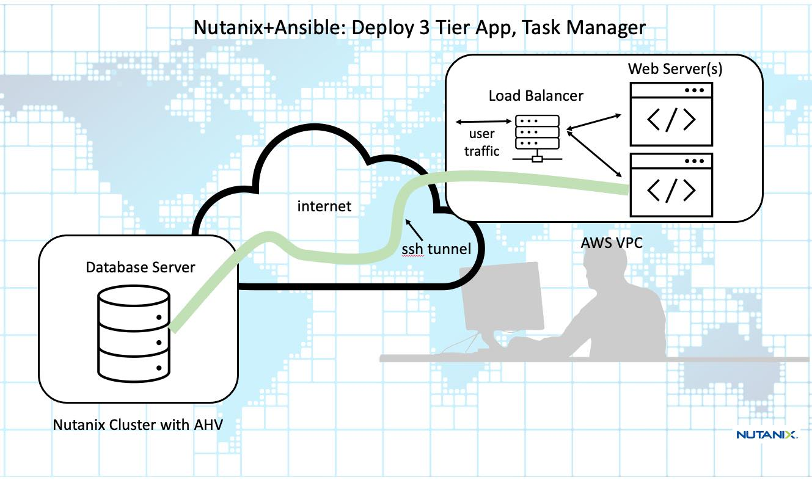
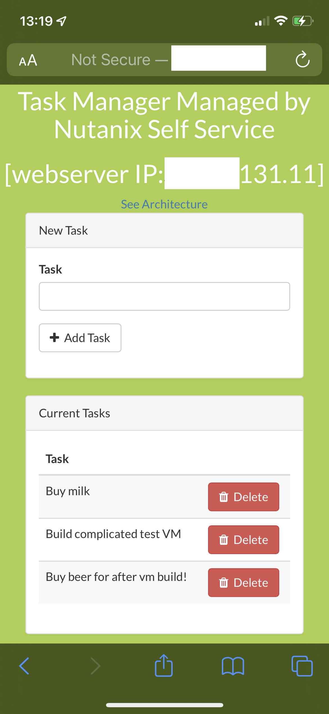

# ntnxAnsAws3tierSqlserver

Ansible playbooks to deploy 3-tier Tasks Laravel web app with Microsoft SQL Server dbserver (on Nutanix AHV) and nginx web servers on AWS.

The main playbook has copious comments: ntnxawsplay.yaml

<h2>Application Architecture</h2>

This 3 tier application, a webapp, is deployed, using Ansible, with SQL Server as the back-end database.  Two nginx servers make up the middle layer and the front-end loadbalancer is implemented using HAProxy.  The latter two layers are deployed onto AWS and the database server is deployed onto a Nutanix AHV cluster.  The database layer and the middle webserver layer communicate over a (reverse) ssh tunnel - this means there's no need for an AWS site-site vpn and once the app has been deployed any user anywhere from any device with a browser can enter the public IP address of the loadbalancer and get to the Task Manager webapp.

 
<h2>Application UI</h2>

<h2>Pre-requisites</h2>

I used an Ubuntu 20.04.1 workstation VM running under VirtualBox.

<ol>
     <li>Ansible core 2.13.2</li>
     <li>Nutanix Ansible Module: https://github.com/nutanix/nutanix.ansible - great blog walk-thru: https://www.nutanix.dev/2022/08/05/getting-started-with-the-nutanix-ansible-module/</li>
     <li>AWS Account with valid API key and secret key, if you can run the aws cli then you rshould be good with the permissions you have</li>
     <li>AWS VPC including subnet, key pair (pem file) and inbound security group rules - see the comments in the playbook.</li>
     <li>Nutanix AHV based cluster managed by Prism Central (PC), with credentials</li>
     <li>CentOS 7 AHV disk image, from here: http://10.42.194.11/workshop_staging/Windows2019.qcow2 (Internal only - or you can make your won - should be sysprep'd)- the getImageplay.yaml Ansible playbook will fetch the image for you - edit vars/vars.yaml first.
</ol>
<h1>How to install and get the webapp working</h1>
<ol>
     <li>verify pre-reqs above</li>
     <li>git clone this repo</li>
     <li>edit vars/vars.yaml to reflect your PC and AWS VPC - just the variables marked EDIT</li>
     <li>Optional: edit getImageplay.yaml to reflect your Prism Central(PC)</li>
     <li>Optional: $ ansible-playbook getImageplay.yaml - Or you can use the PC UI to upload the image as CentOS7.qcow2 from the URI above.</li>
     <li>Althouh previous steps are optional you HAVE to have a valid Windows 2019 AHV Disk image!</li>
     <li>copy your ec2 key pair file (something.pem) to the repo folder where all the other files are</li>
     <li>$ ansible-playbook ntnxawsplay.yaml</li>
</ol>

The last task to be run will print out the public IP addresses of the loadbalancer (HAProxy) and the two webservers.  Point your browser to the IP address of the loadbalancer and you will be routed through to the Task Manager webapp.

<h1>Timings</h1>
On average complete deployment (not including the image upload) for the main ntnxawsplay.yaml (ie. the whole 3-tier application and components) takes about 20-30 minutes - sometimes longer.  This is because the VMs have to install packages and updates as well as perform the installtion and customization of the application.
<h2>Demo Flow</h2>

Try it out a few times to get used to the timings - things can take 20-30 minutes to deploy plus timing for database clones if you move on to a Nutanix Database Service (aka Era) demo.  Best have things pre-deployed and show how additional deployments are done.
<ul>
     <li>Show full deployment (pre-deployed)</li>
     <li>Show / talk through components</li>
     <li>Ask attendees to enter Tasks via the their devices (use public IP Address of the loadbalancer or public IP address of either webserver</li>
     <li>Show a database clone happening</li>
     <li>Delete some tasks</li>
     <li>Use Microsoft SQL Server Studio to connect to the original and clones datbases and show difference in data.  You can show this by logging into the console of the Windows Server and start the program from there.</li>
     <li>For the demo any passwords / userids you would have entered in vars/vars.yaml.
</ul>
<h2>Versions</h2>

Tested and working with:
<ul>
     <li>Client Workstation (VM under VirtualBox 6.1.36 r152435 (Qt5.6.3)): Ubuntu 20.04.1 LTS (jammy)</li>
     <li>AOS: 5.20.1.1</li>
     <li>Prism Central (PC): pc.2022.6</li>
     <li>Ansible-core: 2.13.2 (Python 3.10.4)</li>
     <li>Ansible: 6.2.0</li>
     <li>Windows Server: Microsoft Windows Server 2019 Standard Evaluation, OS Version: 10.0.17763 N/A Build 17763</li>
     <li>AWS: aws-cli/2.7.22 Python/3.9.11 Linux/5.15.0-46-generic exe/x86_64.ubuntu.22 </li>
     <li>Nutanix Ansible Module: nutanix.ncp: 1.4.0</li>
     <li>Nutanix Database Service (aka Era): 2.4.1 (Optional - but not if you want to demo it).
</ul>
<h1>Issues and Observations</h1>
<ul>
     <li>The ssh tunnels between the webservers and the database server will drop after about 2 hours - beware if demoing, advise setup maybe 45 minutes before needed.</li>
     <li>Timing:  There are "pause" tasks implemenetd in the playbook as sometimes the VMs have not quite customized or other reasons.  These should be long enough but you may need to vary them sometimes.</li>
     <li>"Unable to connect" message - on occasion the playbook task trying to connect to any of the VMs will error "could not connect" or similar message.  I advise simply to delete everything created so far and re-running the playbook.</li>
     <li>Sometimes I got "AWS was not able to validate the provided access credentials" when running a playbook - check the time on your workstation - if it's out by only a few minutes then AWS will not accept your credentials.  Set the current time on your workstation to fix.  </li>
</ul>
